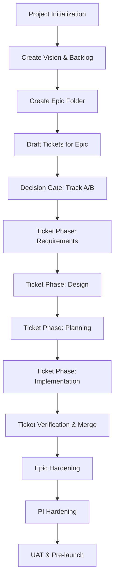

# BOB — Agentic SDLC Orchestrator: Workflow Overview

This document captures the **core end-to-end workflow** for BOB (the Agentic SDLC Orchestrator). It serves as the canonical reference so that humans and agents don't need to re-explain how projects, epics, and tickets progress through the Three‑Layer SDLC.

> 📄 **Command Reference:** For the full list of `ai-engine` CLI commands, see [engine/docs/ai_engine.md](../engine/docs/ai_engine.md).

## 1. Project Initialization

1. Clone template or start new workspace.
   - **Commands:** `git clone <template>`, `ai-engine project-init` (npm: `npm run start --prefix ./engine -- project-init`).
   - **Prompts:** "Act as Senior Solution Architect", "/init-project", "Help me define the project".
2. Run `ci/ci_config.sh`; set `tech_stack` and ensure testing framework is configured.
   - **Commands:** `bash ci/ci_config.sh`.
   - **Prompts:** "Set up the framework" (initial); "Install the framework" for first-time.
3. **Memory seed**: execute the startup script to populate `/memories/repo/` with framework rules and past lessons.
   - **Commands:** (internal startup script invoked by `ai-engine project-init` or manually `node scripts/seed-memory.js`).
   - **Prompts:** "Remember" or custom project-init prompt automatically triggers memory seeding.
4. Populate foundation files: `vision.md`, `PRD.md`, `FRD.md`, `style_guide.md`, `sitemap.md`, `interaction_guide.md`, and `backlog.md`.
   - **Commands:** `/init-project` flow will generate stubs; use `ai-engine research` as needed.
   - **Prompts:** "Define project foundation".

## 2. Epic Creation

1. Create `web-applications/project-management/epics/EPIC-XXX/` directory.
   - **Commands:** `/scope-epic` (slash command) or `ai-engine plan EPIC-XXX` to start breaking down.
   - **Prompts:** "Scope epic", "Break down this epic".
2. Add subfolders and docs:
   - `requirements/README.md`
   - `design/README.md`
   - `planning/README.md`
   - (empty) `testing/`, `implementation/`, `deployment/`, `monitoring/`
   - **Commands:** none; scaffolding typically manual or via `/scope-epic`.
3. Draft all tickets for the epic before any code.
   Each ticket gets its own subfolder with the six-phase structure.
   - **Commands:** `ai-engine create-ticket` (if available) or simply copy template.
   - **Prompts:** "Plan this feature", "I have completed strategic planning".

## 3. Ticket Lifecycle (Layer 1)

### 3.1 Track Decision Gate (Required First Step)

**Before starting ANY ticket work**, you must run the manual decision gate:

1. **Automated Scanner**: Initial scaffolding only (may be inaccurate)
2. **Human Decision Gate**: Required step using official `WORKFLOW_DECISION_GATE.md`
3. **Update Track**: If scanner was wrong, update `TRACK_DECISION.md` and `metadata.json`

**Commands**: None (manual process)
**Reference**: `.agent/rules/TICKET_SCOPING.md`

### 3.2 Ticket Progression Phases

Each ticket progresses through these phases. The table below shows the primary commands agents should use at each phase; `/bob` will call many of these under the hood.

### Phase → Commands (Ticket Level)

| Phase            | Primary Commands                                                                                  |
|------------------|---------------------------------------------------------------------------------------------------|
| Requirements     | `/review-requirements`, `ai-engine research T-XXX`                                               |
| Design           | `/review-design`, `/design-ui`, `ai-engine plan T-XXX`                                           |
| Planning         | `/update-planning`, `ai-engine deps T-XXX`, `ai-engine next`                                     |
| Implementation   | `/execute-plan`, `/writing-test`, `ai-engine run T-XXX`, `npm run start --prefix ./engine -- run T-XXX` |
| Verification     | `/verify-ticket`, `ai-engine validate T-XXX`, `bash ci/verify.sh`                                |
| Merge            | `git` commands, `ai-engine status T-XXX`                                                         |

`agents_commands_index.md` remains the full catalog; this table is the minimal, recommended surface for everyday work.

Each ticket progresses through these phases:

1. **Requirements**: define goals, acceptance criteria, wireframes.
   - **Commands:** `/review-requirements`, `ai-engine research T-XXX`.
   - **Prompts:** "Review requirements", "Plan this feature".
2. **Design**: choose architecture patterns, sketch data/API flows.
   - **Commands:** `/review-design`, `ai-engine plan T-XXX`.
   - **Prompts:** "Review design".
3. **Planning**: break into breaths (Track B) or single breath (Track A), estimate, document dependencies.
   - **Commands:** `/update-planning`, `ai-engine deps T-XXX`, `ai-engine next`.
   - **Prompts:** "Update planning", "What should I work on?".
4. **Implementation**: code, tests, lint, manual sanity.
   - **Commands:** `ai-engine run T-XXX`, `ai-engine execute T-XXX`, `/execute-plan`, `/writing-test`, `npm run start --prefix ./engine -- run T-XXX`.
   - **Prompts:** "Execute plan", "Run T-XXX", "Write tests".
   - Track A: single-breath.
   - Track B: implement breath-by-breath, verifying each increment.
   - **Autonomous mode** must not alter requirements/tasks: new discoveries pause and prompt a human update.
5. **Autonomous Verification**: run `bash ci/verify.sh` and score ≥ 56/70. Fill out `verification-gate.md` and `testing/README.md`.
   - **Commands:** `/verify-ticket`, `ai-engine validate T-XXX`.
   - **Prompts:** "Verify ticket", "Check implementation".
6. **Merge**: add to epic branch when gate passes.
   - **Commands:** standard `git merge` or `ai-engine status` for readiness.
   - **Prompts:** "Did I do it right?" (trigger verification before merge).

> **Decision Gate**: before any ticket work, complete `project-management/WORKFLOW_DECISION_GATE.md` to select Track A or B.
   - **Commands:** read the file; no specific CLI required but you may run `ai-engine framework-test` as a sanity check.
   - **Prompts:** "Analyze current codebase" or "Migrate to Three‑Layer SDLC" when adopting.

> **Decision Gate**: before any ticket work, complete `project-management/WORKFLOW_DECISION_GATE.md` to select Track A or B.

## 4. Epic Hardening (Layer 2)

1. Confirm each ticket's `metadata.json` is approved.
   - **Commands:** `ai-engine status` or `ai-engine validate` to check ticket states; `/audit-layer-1` for a consolidated review.
   - **Prompts:** "Is Epic [X] ready for hardening?", "What should I work on?" (to verify no blockers remain).
2. Execute `ci/pipeline.sh` (static analysis, tests, scans).
   - **Commands:** `bash ci/verify.sh --layer2`, `ci/pipeline.sh`, `/harden-epic`.
   - **Prompts:** "Start Epic Hardening protocol for Epic [X]", "Harden Epic [X]".
3. Complete `threat_model.md` and `api_contract.md` templates.
   - **Commands:** manual editing; use `/review-design` or `/discover` to validate assumptions.
   - **Prompts:** "Review design", "Discover backlog" (if gaps appear).
4. Run regression/E2E tests across the epic.
   - **Commands:** invoke the project’s regression test suite; `ai-engine execute` with epic context; `/frontend-test-suite`, `/backend-test-suite`.
   - **Prompts:** "Verify epic".
5. Perform gap analysis vs. design/PRD.
   - **Commands:** `/discover` for anomalies; `ai-engine research` with PRD context; run the prompt "Audit Epic [X] against PRD".
   - **Prompts:** "Audit Epic [X] against PRD", "Check implementation for Epic [X]".
6. Tag release (semantic versioning).
   - **Commands:** `git tag vX.Y.Z`; `ai-engine overview` to snapshot project metrics.
   - **Prompts:** "Is Epic [X] ready for release?" (implicit through hardening prompts).

## 5. PI Hardening (Layer 3)

1. Update `PI-XXX_Manifest.md` with all epics and DOD items.
   - **Commands:** `/init-pi` or manual update; use `ai-engine overview` to check epics status.
   - **Prompts:** "Start PI with epics" or "Initialize PI manifest".
2. Enforce DOD:
   - Zero mocks
   - 100 % BE coverage
   - Full FE screen/interaction coverage
   - Security and vulnerability scans
   - **Commands:** `bash ci/verify.sh --layer3`; `/harden-pi`; `/pre-harden-pi` before running checks.
   - **Prompts:** "Hardening Protocol for Project Initiative [X]", "Initialize Pre-Hardening Testing for PI-[X]".
3. Conduct security blitz and performance checks.
   - **Commands:** security scan scripts (`security_scan.sh`), performance tests.
   - **Prompts:** "Hardening Protocol for Project Initiative [X]" usually triggers this step.
4. Generate `PRODUCTION_RELEASE_NOTES.md`.
   - **Commands:** `make release-notes` (if available) or manual.
   - **Prompts:** "Prepare release notes".
5. Final gate: no PI ships until all manifest items complete.
   - **Commands:** final `ai-engine framework-test` or `ci/pipeline.sh` with layer3 flag.
   - **Prompts:** "Hardening Protocol for Project Initiative [X]" (repeat until gate passes).

## 6. UAT & Pre-Launch

1. Internal QA and stakeholder user acceptance testing.
   - **Commands:** `/uat-phase`, run dedicated UAT test suites.
   - **Prompts:** "Handle UAT Testing Phase".
2. Log issues; route back into Layer 1/2 as needed.
   - **Commands:** `/log` to record activity; open new tickets with `ai-engine run`.
   - **Prompts:** "Log this", "Discover backlog".
3. Prepare environment, monitoring, and roll-out plans.
   - **Commands:** deployment scripts, `make deploy` (if exists).
   - **Prompts:** "Prepare environment".
4. Launch and monitor.
   - **Commands:** monitoring dashboards, `make status` to check services.
   - **Prompts:** "Start working" (for launch), "Check services".

## 7. Workflow Principles

- No requirement drift: scope changes are never invented by agents. Humans update tickets.
  - **Commands:** `/debug` or `/reflect` when issues are found; open new tickets manually.
  - **Prompts:** "Did I do it right?", "Reflect".
- Memory update mandatory after each ticket, epic, and PI.
  - **Commands:** `/remember`, `/capture-knowledge`, `ai-engine insights`.
  - **Prompts:** "Remember", "Show Learning Insights".
- Parallel work allowed for independent tickets/epics.
  - **Commands:** `ai-engine next` to pick unblocked tickets.
  - **Prompts:** "What should I work on?", "List Ready Tickets".
- Circuit breaker: stop and escalate if blocked for > 10 min or new roadblocks arise.
  - **Commands:** `/debug`, `/handoff` when pausing.
  - **Prompts:** "Something's broken" or "Services are down" to trigger diagnostic workflow.

---

### Visual Diagram

---

The diagram above visualizes the flow from project start through to launch. Each ticket loops through the six phases; once all tickets are merged, the process ascends to epic hardening and then PI hardening.

This document will be the canonical explanation shipped with the framework; agents and humans can reference it instead of repeating the workflow verbally.
