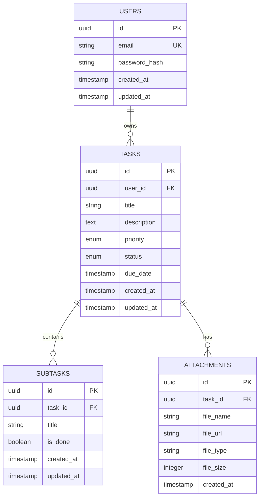

# Database Schema: TodoAppCertification

## 1. Overview
The database for TodoAppCertification is built on a relational model (PostgreSQL) focusing on data integrity, efficient task querying, and clear hierarchical relationships between tasks and subtasks.

## 2. Entity Relationship Diagram (ERD)


## 3. Tables

### Table: `users`
| Column | Type | Constraints | Description |
| --- | --- | --- | --- |
| `id` | UUID | PRIMARY KEY, DEFAULT gen_random_uuid() | Unique identifier for the user. |
| `email` | VARCHAR(255) | UNIQUE, NOT NULL | User's email address for login. |
| `password_hash` | TEXT | NOT NULL | Salted and hashed password. |
| `created_at` | TIMESTAMPTZ | DEFAULT NOW() | Timestamp when user was created. |
| `updated_at` | TIMESTAMPTZ | DEFAULT NOW() | Timestamp of last update. |

### Table: `tasks`
| Column | Type | Constraints | Description |
| --- | --- | --- | --- |
| `id` | UUID | PRIMARY KEY, DEFAULT gen_random_uuid() | Unique identifier for the task. |
| `user_id` | UUID | FOREIGN KEY (users.id), NOT NULL | Owner of the task. |
| `title` | VARCHAR(255) | NOT NULL | Title of the task. |
| `description` | TEXT | | Detailed description. |
| `priority` | ENUM | 'low', 'medium', 'high', 'urgent' | Priority level. |
| `status` | ENUM | 'pending', 'in_progress', 'completed' | Current task status. |
| `due_date` | TIMESTAMPTZ | | Deadline for the task. |
| `created_at` | TIMESTAMPTZ | DEFAULT NOW() | Creation timestamp. |
| `updated_at` | TIMESTAMPTZ | DEFAULT NOW() | Last update timestamp. |

### Table: `subtasks`
| Column | Type | Constraints | Description |
| --- | --- | --- | --- |
| `id` | UUID | PRIMARY KEY, DEFAULT gen_random_uuid() | Unique identifier. |
| `task_id` | UUID | FOREIGN KEY (tasks.id), NOT NULL | Parent task. |
| `title` | VARCHAR(255) | NOT NULL | Subtask name. |
| `is_done` | BOOLEAN | DEFAULT FALSE | Completion status. |
| `created_at` | TIMESTAMPTZ | DEFAULT NOW() | Creation timestamp. |
| `updated_at` | TIMESTAMPTZ | DEFAULT NOW() | Last update timestamp. |

## 4. Indexes
- `idx_users_email`: B-Tree on `users.email` (Unique lookup).
- `idx_tasks_user_id`: B-Tree on `tasks.user_id` (Filtered dashboard views).
- `idx_subtasks_task_id`: B-Tree on `subtasks.task_id` (Task detail lookups).
- `idx_tasks_due_date`: B-Tree on `tasks.due_date` (Sorting tasks by deadline).

## 5. Sample SQL Migration
```sql
CREATE TYPE task_priority AS ENUM ('low', 'medium', 'high', 'urgent');
CREATE TYPE task_status AS ENUM ('pending', 'in_progress', 'completed');

CREATE TABLE users (
    id UUID PRIMARY KEY DEFAULT gen_random_uuid(),
    email VARCHAR(255) UNIQUE NOT NULL,
    password_hash TEXT NOT NULL,
    created_at TIMESTAMPTZ DEFAULT NOW(),
    updated_at TIMESTAMPTZ DEFAULT NOW()
);

CREATE TABLE tasks (
    id UUID PRIMARY KEY DEFAULT gen_random_uuid(),
    user_id UUID NOT NULL REFERENCES users(id) ON DELETE CASCADE,
    title VARCHAR(255) NOT NULL,
    description TEXT,
    priority task_priority DEFAULT 'medium',
    status task_status DEFAULT 'pending',
    due_date TIMESTAMPTZ,
    created_at TIMESTAMPTZ DEFAULT NOW(),
    updated_at TIMESTAMPTZ DEFAULT NOW()
);

CREATE TABLE subtasks (
    id UUID PRIMARY KEY DEFAULT gen_random_uuid(),
    task_id UUID NOT NULL REFERENCES tasks(id) ON DELETE CASCADE,
    title VARCHAR(255) NOT NULL,
    is_done BOOLEAN DEFAULT FALSE,
    created_at TIMESTAMPTZ DEFAULT NOW(),
    updated_at TIMESTAMPTZ DEFAULT NOW()
);
```
