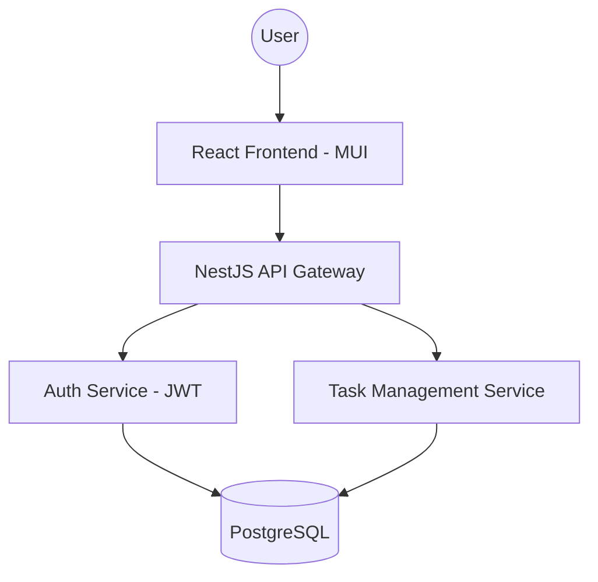

# System Architecture: TodoAppCertification

## 1. Tech Stack
- **Frontend:** React with TypeScript, Vite, Material UI (MUI).
- **Backend:** Node.js with TypeScript (NestJS).
- **Database:** PostgreSQL (Relational).
- **Auth:** JWT / Passport.js.
- **API:** RESTful.

## 2. High-Level Architecture

## 3. Data Model (Draft)
### Users
- `id` (UUID), `email` (Unique), `password_hash`, `created_at`

### Tasks
- `id` (UUID), `user_id` (FK), `title`, `description`, `priority` (Enum), `status` (Enum), `due_date`, `created_at`

### Subtasks
- `id` (UUID), `task_id` (FK), `title`, `is_done` (Boolean), `created_at`

## 4. Security
- Use CORS to restrict access.
- Implement rate limiting on Auth endpoints.
- Sanitize all user inputs to prevent XSS and SQL Injection.
