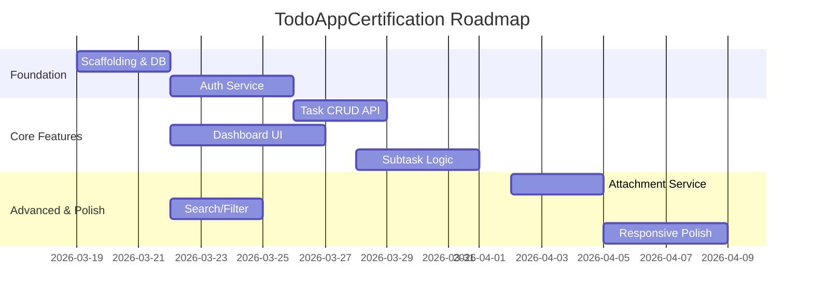

# Project Timeline: TodoAppCertification

## 1. Overview
The development of TodoAppCertification is structured into 3 main sprints, each lasting approximately 1 week (assuming standard velocity). The total estimated duration is 3 weeks to reach Production Readiness (PI-1).

## 2. Sprints

### Sprint 1: Foundation & Auth (Week 1)
- **Focus:** Backend infrastructure and secure user authentication.
- **Epic:** Epic 1 (Foundation & Authentication)
- **Goal:** Users can register and log in securely.

### Sprint 2: Core Features (Week 2)
- **Focus:** Task management CRUD and subtask hierarchy dashboard.
- **Epic:** Epic 2 (Core Task Management)
- **Goal:** Functional dashboard with full task/subtask lifecycle.

### Sprint 3: Polish & Launch (Week 3)
- **Focus:** Attachments, advanced UX (search/filter), and performance optimization.
- **Epic:** Epic 3 (Advanced Features & Polish)
- **Goal:** Production-ready app with file support and mobile responsive polish.

## 3. Milestones
- **M1: Alpha (End of Week 1):** Backend API functional with Auth.
- **M2: Beta (End of Week 2):** Core UI functional on Web.
- **M3: Release Candidate (Mid Week 3):** All features implemented and verified at Layer 1.
- **M4: Production Ready (End Week 3):** PI-1 Hardening complete.

## 4. Roadmap (Gantt)

