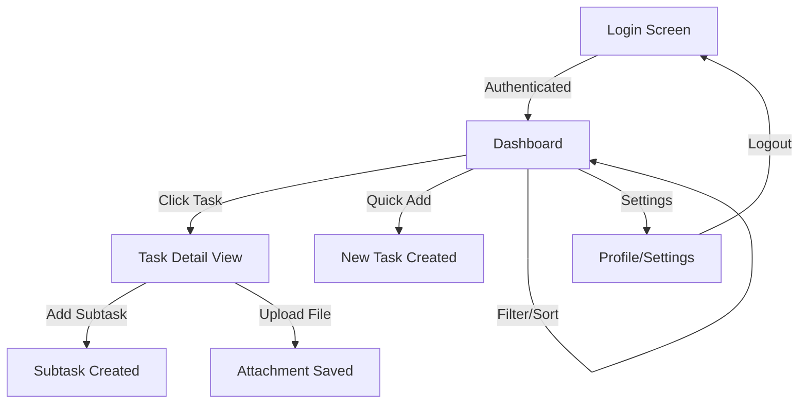

# User Flow: TodoAppCertification

## Overview

A comprehensive task management journey from secure authentication to granular task and subtask organization with attachment support.

## User Flow Diagram

## User Stories

### Account Creation

**As a** New User  
**I want** to create an account with my credentials or social login  
**So that** I can start managing my tasks securely across devices.

**Acceptance Criteria:**
- System validates email format and password strength.
- User is redirected to the dashboard upon successful registration.
- Social login (Google/Facebook) correctly maps to a user profile.

### Task & Subtask Organization

**As a** Busy Professional  
**I want** to break down large tasks into smaller subtasks  
**So that** I can track granular progress and ensure nothing is missed.

**Acceptance Criteria:**
- User can add multiple subtasks to a single parent task.
- Subtasks have their own completion status.
- Main task cannot be marked complete if subtasks are pending (optional toggle).

### Priority Triaging

**As a** Task Manager  
**I want** to filter and sort my dashboard by priority and status  
**So that** I can focus on the most urgent tasks first.

**Acceptance Criteria:**
- Dashboard updates instantly when a filter is applied.
- Sorting by priority correctly orders tasks from Urgent to Low.

## Screen Flow

1. **Login/Signup Screen**: Entry point for authentication with forms for email/password and social login buttons.
2. **Dashboard**: Main view listing all tasks with quick-add functionality, filters, and search.
3. **Task Detail View**: Focused view for a single task showing description, subtasks, and attachments.
4. **Profile/Settings**: User preferences and logout options.

---

*Generated by Bob Framework*  
*Date: 2026-03-18T13:04:52.489Z*
